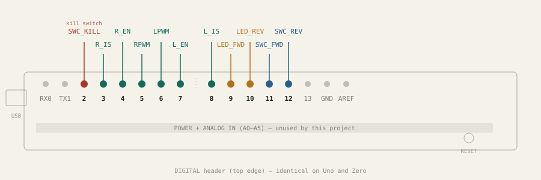
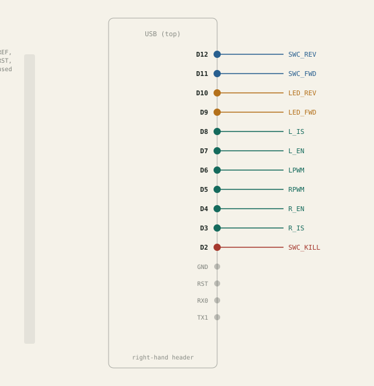

# dirtyvan

Arduino van motor controller - a two-button (forward/reverse) DC motor
controller built for a van conversion (e.g. a fold-down bed lift), with a
run-time cutoff, a kill/limit switch, and noise filtering on the button
inputs so brief errant signals don't trigger the motor.

## What it does

- **Forward/reverse buttons**: pressing FWD or REV starts the motor in that
  direction. Pressing the *same* button again while already running stops
  it (toggle). Pressing the *other* button switches direction immediately.
- **Max run time**: the motor auto-stops after `gMotorTimeout` (35s by
  default - sized for a ~30s travel time), blinking both direction LEDs for
  the last `gMotorBlinkTimeout` (3s) as a warning before cutoff.
- **Kill/limit switch**: a normally-closed switch that, when opened, stops
  the motor if it's currently retracting (forward/CW) and blocks a new
  forward command - meant to be wired to a physical limit switch at the end
  of travel.
- **Noise filter**: a button state has to hold steady for `gMinPressTime`
  (50ms) before it's acted on, so brief electrical noise on the input lines
  doesn't register as a press.
- **Status LEDs**: one LED per direction, lit while that direction is
  actively driving, and used for the pre-timeout blink warning above.

Debug output (state changes, timeouts, kill events) is written to the
serial port at 9600 baud via `serial_printf` (`src/SerialPrintf.h`) - a
lightweight `printf`-style wrapper over `HardwareSerial`.

## Hardware

The controller drives one DC motor through one of three interchangeable
driver boards (only one compiled in at a time - see "Motor driver" below),
from a 3-button panel (forward / reverse / kill). Full pin-by-pin wiring
for the control panel and all three driver boards is in
**[PINOUT.md](PINOUT.md)**.

### Supported target boards

Any Arduino-framework board works - the same pin numbers apply across all
of them (see `platformio.ini`):

- Arduino Uno
- Arduino Zero (default build environment)
- Arduino Nano (ATmega328)

**Uno / Zero** (identical shield header):



**Nano** (right-hand header):



An interactive version with a full legend and per-pin tables for all three
boards is also published [here](https://claude.ai/code/artifact/0db66ead-f9d3-4a62-ab9d-c7dbca33ac03)
(private to your Claude account unless you share it - the images above work
for anyone viewing this repo).

### Motor driver

Selected in `src/DvMotor.cpp` by uncommenting exactly one of:

```cpp
//#define MOTOR_L298N
//#define MOTOR_CYTRON
#define MOTOR_BTS7960
```

- **BTS7960** (`RobojaxBTS7960` library) - currently active. A 43A-class
  dual half-bridge module, used here as a single H-bridge.
- **L298N** (`src/motors/L298N.h`, this project's own class) - a classic
  dual H-bridge module, used single-motor.
- **Cytron MD10C/MD13S** (`src/motors/CytronMotorDriver.h`) - a
  single-channel PWM+DIR driver.

⚠ Switching to Cytron reuses the same Arduino pin as the kill switch - see
[PINOUT.md](PINOUT.md) for the conflict and how to avoid it.

## Building and uploading

This is a [PlatformIO](https://platformio.org/) project.

```bash
# build the default environment (zero-dbg)
pio run

# build/upload a specific target board
pio run -e uno -t upload
pio run -e zero -t upload
pio run -e nanoatmega328 -t upload

# open a serial monitor (9600 baud)
pio device monitor -b 9600
```

`zero-dbg` builds with debug symbols (`-O0 -g -ggdb`) for stepping through
with a debugger; `zero` is the equivalent optimized release build.

## Project layout

```
src/
  main.cpp                 the actual controller (panel logic, timeout, kill switch)
  DvMotor.*                driver-agnostic motor wrapper - selects one of the three drivers below
  SerialPrintf.*           printf-style helper for serial debug output
  motors/
    L298N.*                this project's own L298N driver class
    CytronMotorDriver.*     Cytron MD10C/MD13S driver class
    RobojaxBTS7960.*        Robojax's BTS7960 driver class (currently active)
examples/                  unmodified vendor (Robojax) example sketches for their
                            own Robojax_L298N_DC_motor library - reference only,
                            not part of this project's own driver code
dirtyvan.ino                older standalone prototype (see below) - not part of
                            the PlatformIO build in src/
PINOUT.md                  full pin-by-pin wiring reference
```

### Legacy root sketch

`dirtyvan.ino` at the repo root predates the `DvMotor` abstraction in
`src/` - it drives a single L298N directly via the third-party
`Robojax_L298N_DC_motor` library (the same one in `examples/`), using a
different pin set from the current controller, and isn't part of the
PlatformIO build. It's kept as a historical reference; `src/main.cpp` is
the maintained controller.

## License

MIT (see `library.json`).
